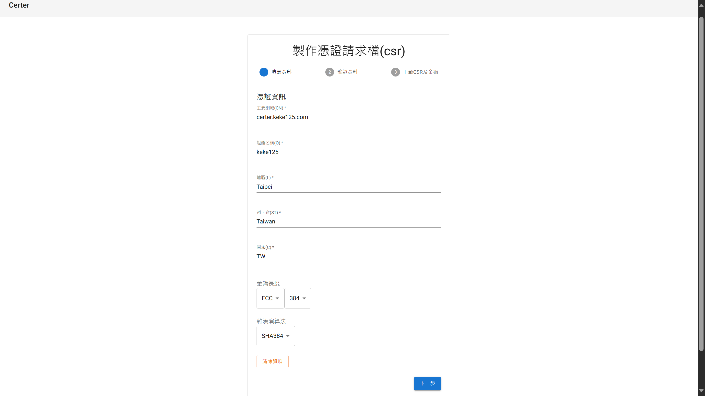
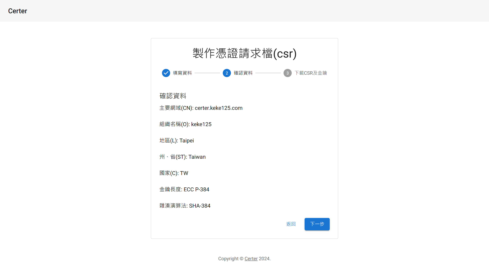
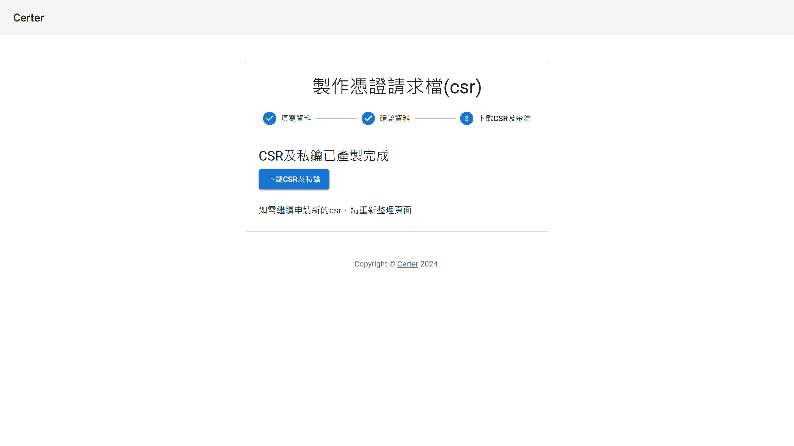

# Certer

`Certer`為免費且開放原始碼的跨平臺網頁程式，提供使用者產生憑證請求檔(CSR)的功能。

## 簡介
本專案為`Next.js`網頁應用程式。程式提供使用者透過網頁產生憑證請求檔(CSR)的功能，而不須使用`Openssl`指令，輸入的資訊將儲存於`Cookie`，於下次使用時自動帶入，避免重複輸入相同資訊。

程式使用瀏覽器內建的`Web Crypto API`來產生金鑰對，使用`pkijs`來產生憑證請求檔，最後使用`jszip`將憑證請求檔及私鑰壓縮後提供使用者下載。

程式在產生金鑰對及憑證請求檔時皆在使用者自己的瀏覽器執行，其他人無法取得，如果有疑慮，可在成功載入網頁後中斷網路連線，或將程式碼下載至本機執行。

## Demo
[certer.keke125.com](https://certer.keke125.com/) 由`Certer`官方維護，提供使用者 Demo。

以`PaaS`方式部署至`Vercel`

## 技術

### 程式語言、框架  
 

## 程式截圖

填寫申請資料

確認申請資料

下載CSR及私鑰